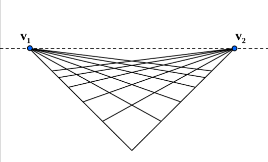

# Найти горизонт
* Сфотографировать параллелепипед или куб в проективной проекции
* При помощи преобразования Хафа найти линии соответствующие граням
* Найти точки пересечения этих линий и провести по ним линию горизонта
* Построить изображение, поверх него линии Хафа. Нарисовать линию горизонта

